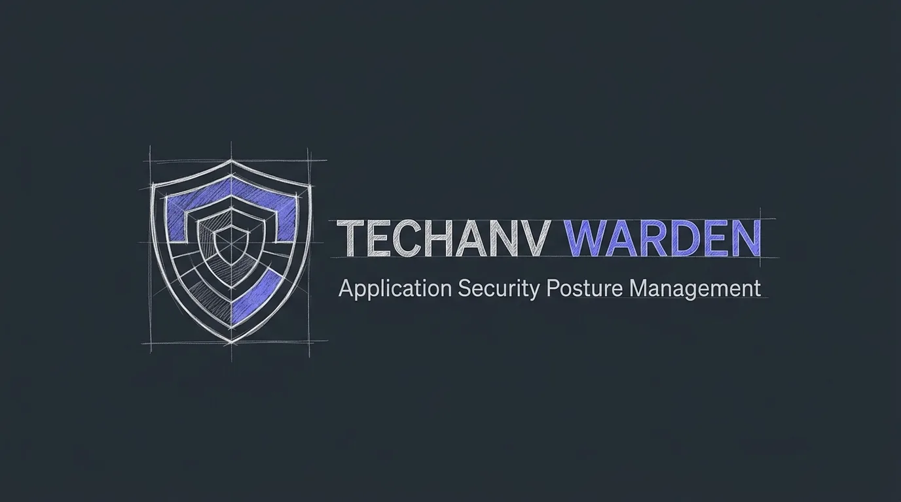
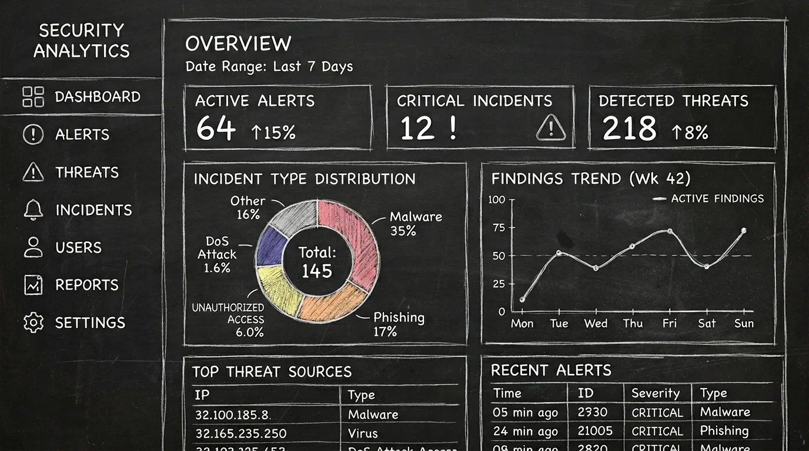
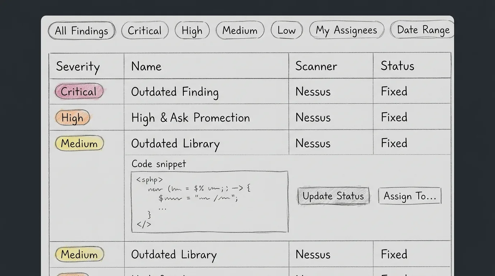
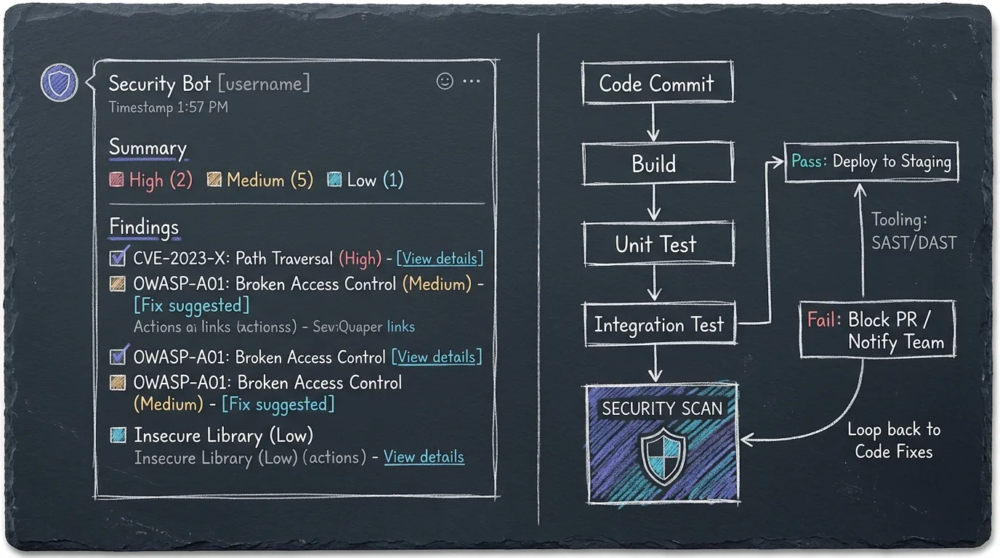
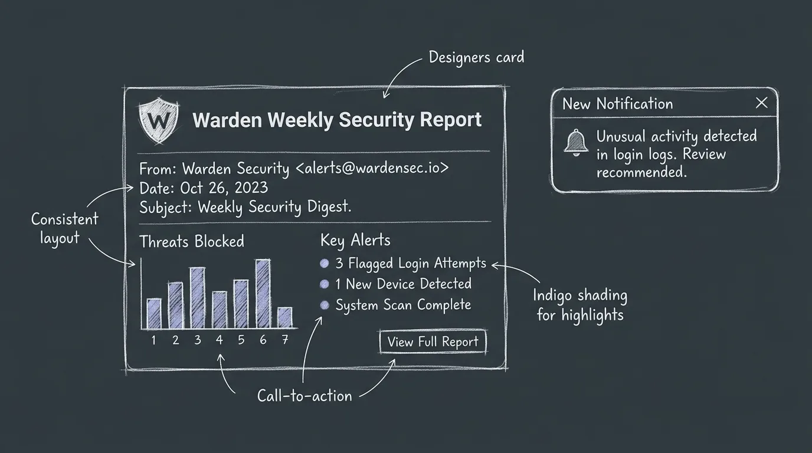
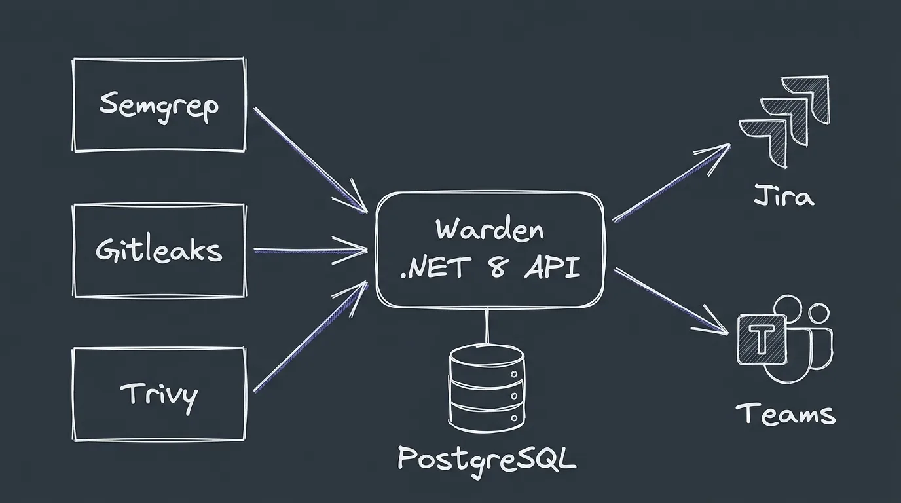

<div align="center">



# Techanv Warden

**Application Security Posture Management for modern engineering teams.**

[](LICENSE)
[](https://github.com/orgs/sussec/packages)
[](warden-api)
[](warden-web)
[](warden-web)

[Documentation](https://sussec.github.io/warden) · [Quick Start](#quick-start) · [Helm / Kubernetes](#kubernetes-helm) · [CI/CD Integration](#cicd-integration) · [Support](#support)

</div>

---

Techanv Warden is a self-hosted **DevSecOps, ASPM (Application Security Posture Management), and vulnerability management platform**. It consolidates results from SAST, secret-detection, and SCA scanners running in your CI/CD pipelines into a single source of truth — with automatic deduplication, finding lifecycle tracking, SLA enforcement, and remediation workflows built in.

## Why Warden

| | |
|---|---|
| **Unified findings** | One dashboard for SAST, secrets, dependency, and container findings across every repository and branch. |
| **Smart deduplication** | Findings are fingerprinted per project — the same issue reported across 50 pipeline runs is one finding, not 50. |
| **Automatic fix detection** | When a confirmed finding disappears from the default branch, Warden marks it fixed — and reopens it if the fix is reverted. |
| **Shift-left feedback** | Scan results posted directly on merge requests, so developers see security issues before merge. |
| **Triage workflow** | Open → Confirmed → Fixed / Accepted Risk / False Positive, with full audit trail, comments, and per-project roles. |
| **Ticketing & alerting** | One-click Jira and Redmine tickets, Microsoft Teams and email alerts, weekly security digests. |
| **Enterprise auth** | OpenID Connect SSO (Keycloak, Entra ID, Okta, …) with reverse-proxy-aware redirect handling, plus local accounts. |

## Product Tour

**Executive dashboard** — organization-wide security posture, severity distribution, and trends at a glance.



**Findings triage** — filter by severity, scanner, rule, branch, or project; bulk-update statuses; export to Excel or PDF.



**Merge request feedback** — findings are commented directly on the MR/PR that introduced them.



**Weekly security digest** — scheduled email and Teams reports keep stakeholders informed without dashboard fatigue.



## Architecture



Warden deploys as three services: the web application (`ghcr.io/sussec/warden-web`), the backend API (`ghcr.io/sussec/warden`), and PostgreSQL. The web service is the single entry point and proxies all API traffic same-origin; sessions are delivered as httpOnly cookies. Scanner wrapper images run inside your existing CI pipelines and push results to Warden over HTTPS using scoped CI access tokens — Warden never needs access to your source code or build infrastructure.

| Component | Technology |
|---|---|
| `warden-api` | .NET 10 · ASP.NET Core · EF Core · PostgreSQL (pgvector) · Quartz.NET |
| `warden-web` | Next.js 16 · React 19 · Tailwind CSS 4 · TanStack Query · Bun |
| API contract | OpenAPI specification at `/openapi/v1.json` drives a generated, fully typed web client; MCP endpoint at `/mcp` |
| Scanners | Semgrep (SAST) · Gitleaks (secrets) · Trivy (SCA & containers) |

## Quick Start

```yaml
# docker-compose.yml
services:
  web:
    image: ghcr.io/sussec/warden-web:latest
    depends_on: [warden]
    environment:
      API_INTERNAL_URL: http://warden:8080
    ports:
      - "8080:3000"                    # single entry point

  warden:
    image: ghcr.io/sussec/warden:latest
    depends_on: [db]
    environment:
      DB_SERVER: db
      DB_USERNAME: warden
      DB_PASSWORD: warden
      DB_NAME: warden
      SYSTEM_PASSWORD: "ChangeMe!"     # initial admin password
      ACCESS_TOKEN_KEY: ""             # set a random 32+ char secret
      REFRESH_TOKEN_KEY: ""            # set a random 32+ char secret
      FRONTEND_URL: http://localhost:8080

  db:
    image: pgvector/pgvector:pg18
    environment:
      POSTGRES_USER: warden
      POSTGRES_PASSWORD: warden
      POSTGRES_DB: warden
      PGDATA: /data/postgres
    volumes:
      - warden_db:/data/postgres
    restart: unless-stopped

volumes:
  warden_db:
```

```bash
docker compose up -d
```

Then open `http://localhost:8080` and sign in as `system` with the password you configured. To build from source instead, clone the repository, copy `.env.example` to `.env`, and run `docker compose up -d --build`. Full installation guide: [sussec.github.io/warden](https://sussec.github.io/warden).

## Kubernetes (Helm)

Deploy the full stack (API, web, OSV, PostgreSQL+pgvector) with the chart in [`charts/warden`](charts/warden):

```bash
helm upgrade --install warden ./charts/warden \
  --namespace warden --create-namespace \
  --set secrets.systemPassword='YourStrongSystemPass!' \
  --set secrets.accessTokenKey="$(openssl rand -hex 16)" \
  --set secrets.refreshTokenKey="$(openssl rand -hex 16)" \
  --set secrets.postgresPassword="$(openssl rand -hex 16)"

kubectl -n warden port-forward svc/warden-web 8080:3000
```

Production Ingress example: `charts/warden/values-production.yaml`. Chart details: [charts/warden/README.md](charts/warden/README.md).

## CI/CD Integration

Warden integrates with **GitLab CI/CD** and **GitHub Actions** through dedicated scanner images. Generate a CI access token under **Settings → Access Token**, then add a stage to your pipeline:

```yaml
# .gitlab-ci.yml — SAST with Semgrep
semgrep:
  stage: test
  image: ghcr.io/sussec/warden-semgrep:latest
  variables:
    WARDEN_URL: $WARDEN_URL
    WARDEN_TOKEN: $WARDEN_TOKEN
  script:
    - warden-scan
```

| Scanner | Type | Image |
|---|---|---|
| Semgrep | SAST (30+ languages) | `ghcr.io/sussec/warden-semgrep` |
| Gitleaks | Secret detection | `ghcr.io/sussec/warden-gitleaks` |
| Trivy | SCA, container images | `ghcr.io/sussec/warden-trivy` |

See the [Security Integration guide](https://sussec.github.io/warden/security-integration/) for GitHub Actions examples and per-scanner configuration.

## Integrations

- **Source control** — GitLab, GitHub, Bitbucket
- **Ticketing** — Jira (with bidirectional webhook status sync), Redmine
- **Alerting** — Microsoft Teams, SMTP email, scheduled weekly digests
- **Identity** — OpenID Connect SSO, local accounts, role-based access control

## Support

Techanv Warden is built and maintained by [Techanv Consulting](https://github.com/techanvconsulting) — cybersecurity and IT solutions.

- **Issues & feature requests** — [GitHub Issues](https://github.com/sussec/warden/issues)
- **Documentation** — [sussec.github.io/warden](https://sussec.github.io/warden)

## License

Copyright © 2026 Techanv Consulting. Distributed under the [BSD 3-Clause License](LICENSE).
