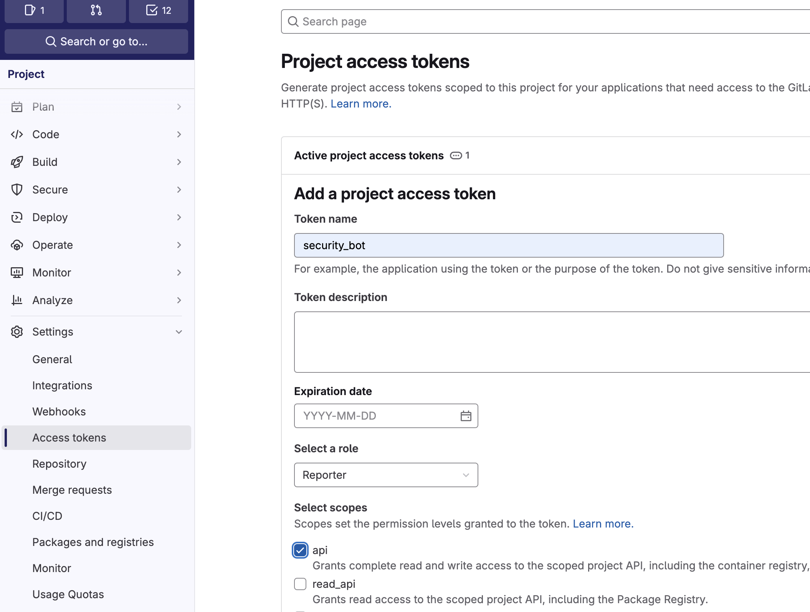

# Environment Variables

In the CI pipeline, the analyzer scans, parses the results, and uploads them to the Techanv Warden. 
An access token is required for authentication with the Techanv Warden. 

The following are the required environment variables.

| ENV               | Require  | Description                                                                        |
|-------------------|----------|------------------------------------------------------------------------------------|
| WARDEN_URL   | true     | The URL of Techanv Warden dashboard. Example: https://finding.example.com             |
| WARDEN_TOKEN | true     | The CI Access Token used for authentication with the Techanv Warden.        |
| GITLAB_TOKEN      | optional | The GitLab token used to comment on merge requests when new findings are detected. |

??? question "How to get WARDEN_TOKEN?"

    Go to **Setting > Access Token** in the Techanv Warden.

    

??? question "How to get GITLAB_TOKEN?"

    Go to **Settings > Access Tokens** in the GitLab project and create a GitLab access token with the role **Reporter** and the **api** scope.

    
