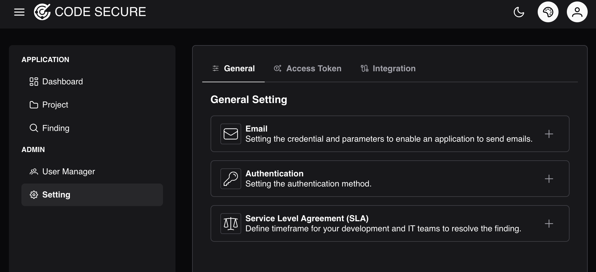
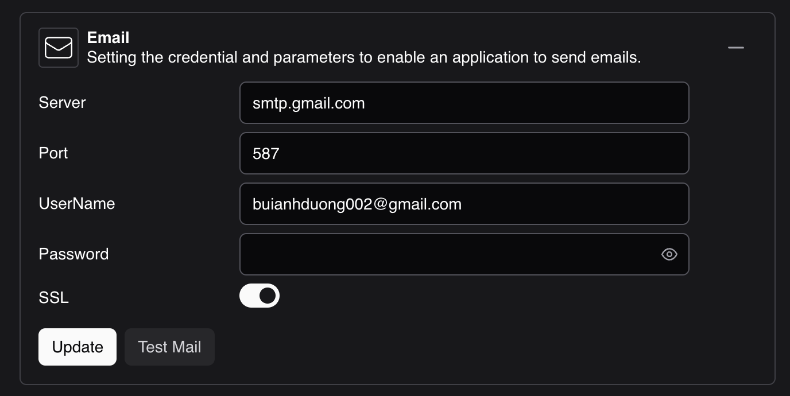
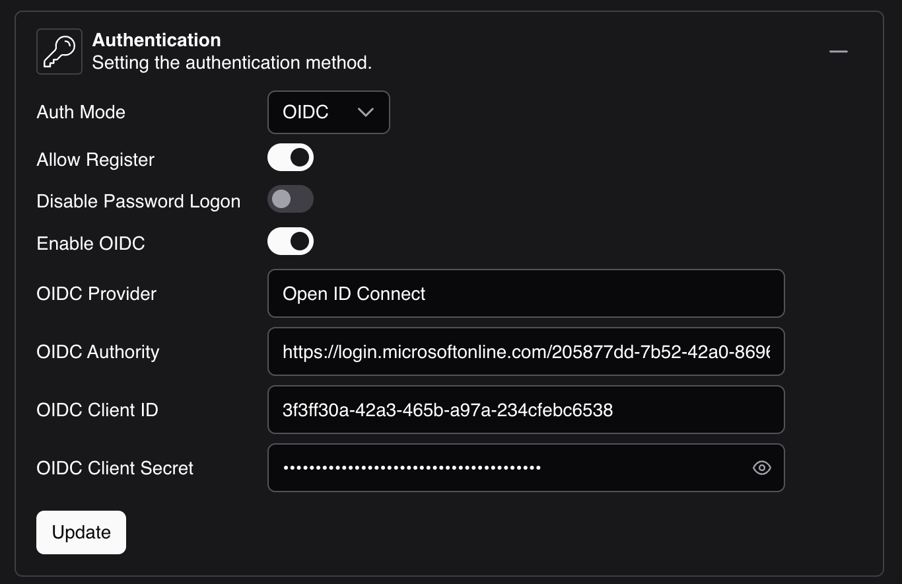
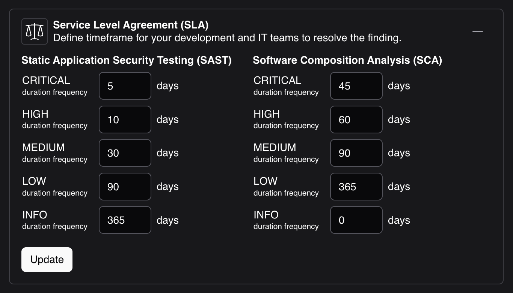

# General Settings

Sign in with an administrator account and navigate to **Setting > General** to configure platform-wide settings.

### Mail <small>required</small>

Email is the primary notification channel. The platform uses it to deliver account invitations, password resets, finding alerts, and scheduled digests.

In the **SMTP** section, provide the following details:

  - **Server:** SMTP server hostname (for example `smtp.gmail.com`)
  - **Port:** SMTP port (for example `587` or `465`)
  - **Username:** the sending account (for example `notifications@example.com`)
  - **Password:** the account password or application-specific password

Use the **Send Test** action to verify the configuration before saving.

### Authentication

Techanv Warden supports password sign-in and OpenID Connect single sign-on. Password sign-in can be disabled once SSO is verified, and self-registration can be restricted to whitelisted email domains.

Sessions are issued as httpOnly cookies; access and refresh tokens are never exposed to client-side scripts.

**OpenID Connect settings**

### Service Level Agreement (SLA)

Define the timeframe, per severity, within which development and IT teams are expected to resolve findings. SLA deadlines drive alerting and reporting.

### AI

Optionally connect an OpenAI-compatible endpoint to enable AI-assisted triage suggestions and semantic search across findings. Provide the endpoint URL, model name, and API key, then use the test action to validate connectivity.
