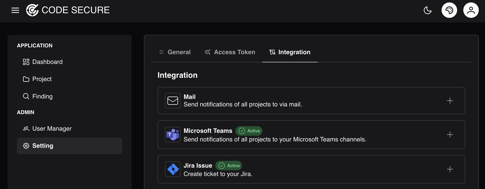
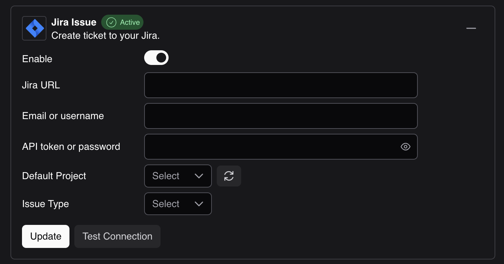
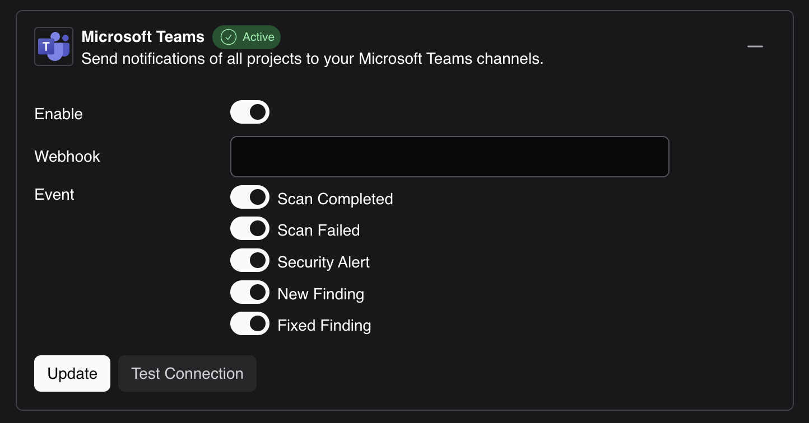
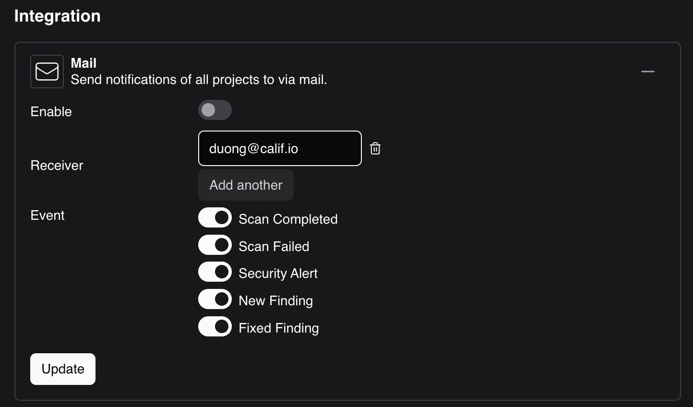

# Integration

Integrations connect Techanv Warden to ticketing, alerting, and email systems. They are configured at two levels:

- **Global** (Setting > Integration): credentials and defaults for the whole platform.
- **Per project** (Project > Setting > Integration): enables an integration for a project and sets project-specific values such as the Jira project key or alert events.

To configure global integrations, sign in with an administrator account and navigate to **Setting > Integration**.

## Secret handling

Secret fields (passwords, API tokens, webhook URLs) are write-only:

- They are returned blank when settings are read, so secrets never leave the server.
- Submitting a form with the secret field left empty keeps the previously stored value.
- The **Test** action saves the current form first and then tests the stored configuration.

## Jira

Creates Jira issues from findings with one click and links them to the finding activity trail.

| Field | Description |
|---|---|
| Web URL | Base URL of the Jira site used for links in the UI |
| API URL | Jira REST API endpoint |
| Username | Jira account (usually an email address) |
| Password / API token | Jira API token; stored write-only |
| Project key | Default Jira project key (overridable per project) |
| Issue type | Issue type for created tickets, for example `Bug` |

### Jira webhook (status sync)

Warden can keep finding status in sync with Jira ticket transitions. Configure a Jira webhook pointing at `POST /api/integration/jira-webhook` with the token configured under the Jira webhook settings, so closing a ticket updates the linked finding.

## Redmine

Creates Redmine issues from findings.

| Field | Description |
|---|---|
| URL | Redmine base URL |
| API token | Redmine API key; stored write-only |
| Project, status, tracker, priority | Numeric Redmine identifiers used for created issues |

## Microsoft Teams

Connect a [Microsoft Teams incoming webhook](https://learn.microsoft.com/en-us/microsoftteams/platform/webhooks-and-connectors/how-to/add-incoming-webhook) to deliver alerts to a Teams channel. The webhook URL is treated as a secret.

Selectable alert events: security alerts, new findings, fixed findings, findings needing triage, scan completed, and scan failed.

## Mail

Delivers the same event alerts by email to a configurable list of recipients. Requires the SMTP server configured under **Setting > General**.

## Per-project overrides

Each project can enable Jira, Redmine, Teams, and Mail independently under **Project > Setting > Integration**, choosing its own Jira project key and issue type, Redmine identifiers, Teams webhook, and alert event selection. Global credentials are reused; project values override global defaults where present.
